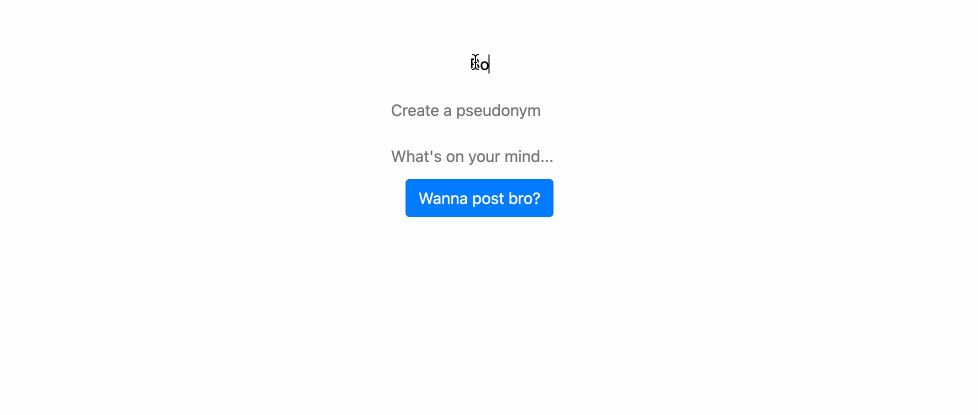

# Lap 2 Code Challenge: Telegraph Clone
Making a [Telegra.ph](https://telegra.ph/) clone with [Alfie](https://github.com/Scralfie)

## Requirements
- Your app should have a browser client allowing users to write a post with a title, a pseudonym and a body
- No login should be required to create a post or visit a post
- When a user hits 'publish', the post should be stored in a database and the client redirected to a show path
- The user should be able to access their post using that show path even after a server restart
- Edit and delete functionality is not required

## Installation and Usage
### Installation

### Usage
Clone repository.  
```cd``` into cloned folder.

Starting up Docker container:  
```bash _scripts/startDev.sh - put into terminal```

- Starts PostgreSQL database
- Starts Express API

Tear down Docker container:  
```bash _scripts/teardown.sh```

Open webpage in ```client/index.html``` using live server.

## Wins & Challenges

### Wins
- Posting and retrieving from database works
- Post shows in browser after posting


### Challenges
- Show path functionality not implemented yet, but will be added in the future

## Final Look

